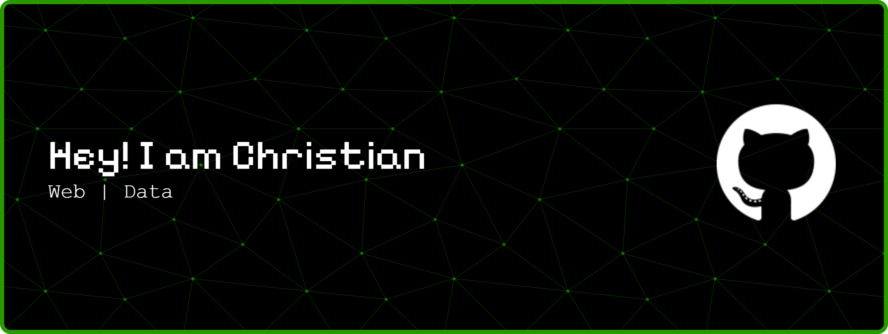

<!-- ### Tech Stack
 -->

<!-- ### Reach Me On
  -->

<picture>
  <source media="(prefers-color-scheme: dark)" srcset="https://raw.githubusercontent.com/KRIZNOOB/KRIZNOOB/output/pacman-contribution-graph-dark.svg">
  <source media="(prefers-color-scheme: light)" srcset="https://raw.githubusercontent.com/KRIZNOOB/KRIZNOOB/output/pacman-contribution-graph.svg">
  
</picture>

###
<!---
KRIZNOOB/KRIZNOOB is a ✨ special ✨ repository because its `README.md` (this file) appears on your GitHub profile.
You can click the Preview link to take a look at your changes.
--->
